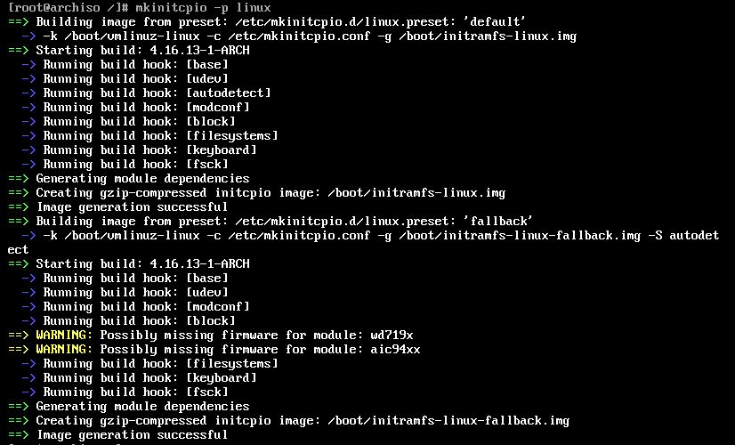

# ArchLinux Note  

## 前言  
之前就稍微玩過Arch Linux，但沒把過程筆記起來，最近又突然想玩，所以稱這個機會把一些東西記下來。  

依據目前官方[Installation guide](https://wiki.archlinux.org/index.php/Installation_guide)所寫，RAM至少要512MB，硬碟空間至少要800MB。  
而我現在是用虛擬機來架設，配置為RAM: 1G; Disk: 8G。  

## Pre Install   
首先開機後進到，選擇`Boot Arch Linux (x86_64)`  
  
接來下開始載入  
  
直到這畫面  
   

### Verify the boot mode  
`ls /sys/firmware/efi/efivars`  
輸入後，回應跟我一樣的話，代表為BIOS(Legacy)  
  

### Connect to the Internet  
`dhcpcd`  
`ping archlinux.org`  
測試網路，出現下面畫面代表有網路  
  

### Update the system clock  
`timedatectl set-ntp true`  
`timedatectl status`  
  

### Partition the disks  
`fdisk -l`  
  
`fdisk /dev/sda`  
因為我是要對sda做分割，這邊要依造當下情況決定，以及因為我是BIOS(Legacy)的關係，我不用割GPT(UEFI 才需要做，有看到資料說可以混用)，但我要先創一個MBR，指令為`o`  
  
可以下`p`做查看  
  
接下來可以下`n`，做分割磁區  
  
接下來我切成這樣，切好後，下`w`寫入離開即完成分割  
  
  

### Format the partitions  
`mkfs.ext4 /dev/sda1`  
`mkfs.ext4 /dev/sda2`  
格式化剛剛分割的空間  
  
`mkswap /dev/sda3`  
`swapon /dev/sda3`  
設sda3為swap空間  
  

### Mount the file systems  
`mount /dev/sda1 /mnt`  
`mkdir /mnt/home`  
`mount /dev/sda2 /mnt/home`  
mount後，可以用`lsblk`查看狀況  
  

## Installation  

### Select the mirrors  
`vim /etc/pacman.d/mirrorlist` 
找到Taiwan後，將那2行移到最上面(善用`d2d` `p`)  
  

### Install the base packages  
`pacstrap /mnt base base-devel`  
  

### Fstab  
`genfstab -U /mnt >> /mnt/etc/fstab`  
`/mnt/etc/fstab`  
  

### Chroot  
`arch-chroot /mnt`  
  

### Time zone  
`ln -sf /usr/share/zoneinfo/Asia/Taipei /etc/localtime`  
`hwclock --systohc`  
  

### Locale  
`vim /etc/locale.gen`  
將以下三個前的#拿掉  
+ `en_US.UTF-8 UTF-8`  
+ `zh_CN.UTF-8 UTF-8`  
+ `zh_TW.UTF-8 UTF-8`  

(可能會出現找不到vim，如果出現的話以`pacman -S vim`做安裝)  
  
`locale-gen`  
  
`/etc/locale.conf`  
檔案是不存在的，在裡面輸入`LANG=en_US.UTF-8`  

### Hostname  
`/etc/hostname`  
檔案是不存在的，在裡面輸入你想要的主機名稱  
`vim /etc/hosts`
將`myhostname`換成自己的名稱  
  

### Root password  
`passwd`  
  

### Initramfs  
`mkinitcpio -p linux`  
  

### Boot Loader
`pacman -S grub`  
`grub-install --target=i386-pc /dev/sda`  
注意此`/dev/sda`，要根據你的ArchLinux灌在哪  
`grub-mkconfig -o /boot/grub/grub.cfg`  
  
  

### Reboot  
`exit`  
`reboot`  
  

## Reference  
[以官方Wiki的方式安装ArchLinux](https://www.viseator.com/2017/05/17/arch_install/)  
[Linux - 簡易安裝 Arch Linux 教學](http://mropengate.blogspot.com/2015/08/linux-arch-linux.html)  
[Installation guide](https://wiki.archlinux.org/index.php/Installation_guide)  
[Linux磁區配置從頭開始 搞定MBR、GPT與UEFI](http://www.netadmin.com.tw/article_content.aspx?sn=1501070001&jump=1)  
[Linux Fdisk 磁碟分割及格式化](https://www.phpini.com/linux/linux-fdisk-create-format-partitions)  
[Linux 系統 Swap 交換空間管理教學：Swap 分割區與檔案的使用與管理](https://blog.gtwang.org/linux/linux-swap-space-tutorial/)  
[Linux 檔案系統掛載（mount）使用教學與範例](https://blog.gtwang.org/linux/linux-mount/)  
[萌妹子都能看懂的VMware Workstation安装Arch Linux和Cinnamon桌面教程](https://acris.me/2017/03/20/How-to-install-Arch-Linux-with-Cinnamon-desktop-on-VMware-Workstation/)  
[Arch Linux Installation and Configuration on UEFI Machines](https://www.tecmint.com/arch-linux-installation-and-configuration-guide/)  
[7 Essential Things To Do After Installing Arch Linu](https://itsfoss.com/things-to-do-after-installing-arch-linux/)  
[Yaourt is Dead! Use These Alternatives for AUR in Arch Linux](https://itsfoss.com/best-aur-helpers/)  