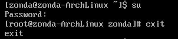

# ArchLinux Base

## User
`useradd -m username`  
-m代表建立家目錄  
  

## sudo
`pacman -S sudo`  
sudo也是一個套件  
  
`visudo`  
讓user可以用sudo
  

## su
`su`  
在一般使用者登入root  
  

## Reference
[Linux 帳號管理與 ACL 權限設定](http://linux.vbird.org/linux_basic/0410accountmanager.php)  