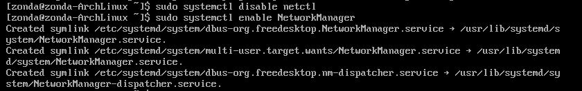
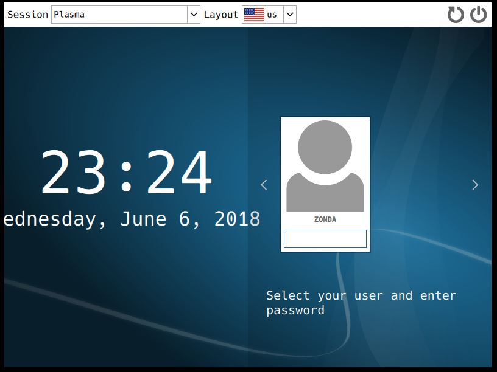

# ArchLinux KDE

## Install
`sudo pacman -S xorg`  
`sudo pacman -S plasma kde-applications`  
裝超久  
`sudo pacman -S sddm`  
  

## Network  
`sudo systemctl disable netctl`  
`sudo systemctl enable NetworkManager`  
  
`sudo pacman -S network-manager-applet`  

## KDE  
  

## Reference
[ArchLinux安装后的必须配置与图形界面安装教程](https://www.viseator.com/2017/05/19/arch_setup/)  
[Archlinux + KDE 安裝經驗](https://lnpcd.blogspot.com/2014/02/archlinux-kde.html)  
[Arch Linux 安裝 KDE 4.x](http://blog.xuite.net/ak47588168/linux/45930520-Arch+Linux+安裝+KDE+4.x)  