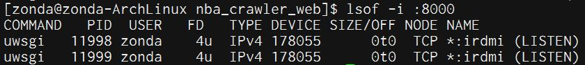
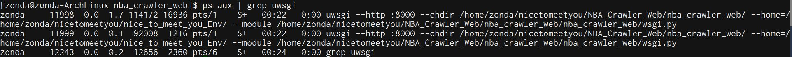

# ArchLinux Web

## uWSGI

`sudo pip install uwsgi`  

### test  
`uwsgi --version` 會出現版號  

建立test.py (note: python3記得string前加b)  
```python
def application(env, start_response):
    start_response('200 OK', [('Content-Type','text/html')])
    return [b"Hello World"]
```
start: `uwsgi --http :8000 --wsgi-file test.py`  
打開瀏覽器，url: localhost:8000，有看到Hello World代表成功。  

### Django  
uwsgi 執行  
格式: `uwsgi --http :8000 --chdir /path/to/project --home=/path/to/env --module project.wsgi`  
/path/to/env: 虛擬環境路徑  
project.wsgi: Django project中的wsgi.py路徑  

`uwsgi --http :8000 --chdir /home/zonda/nicetomeetyou/NBA_Crawler_Web/nba_crawler_web/ --home /home/zonda/nicetomeetyou/nice_to_meet_you_Env/ --module nba_crawler_web.wsgi`  

### lsof  
檢查port  
`pacman -S lsof`  
`lsof -i :8000`
  

`ps aux | grep uwsgi`  
  

### 配置uwsgi.ini

```
[uwsgi]
socket = 127.0.0.1:8000
chdir = /home/zonda/nicetomeetyou/NBA_Crawler_Web/nba_crawler_web/
module = nba_crawler_web.wsgi
processes = 4
threads = 2
pidfile = uwsgi.pid
daemonize = uwsgi.log
home = /home/zonda/nicetomeetyou/nice_to_meet_you_Env/
```
socket: ip:port  
chdir: project path  
module: wsgi.py path  
home: virtual env path  

start ini: `uwsgi --ini uwsgi.ini`  
stop ini: `uwsgi --stop uwsgi.pid`    

原指令是http，但ini要改成socket才能動，原因目前還不清楚。  

## nginx

`pacman -S nginx`  

`sudo vim /etc/nginx/nginx.conf`  

```
server {
    listen      80;
    server_name [server ip];
    charset     utf-8;
    
    location / {
        include uwsgi_params;
        uwsgi_pass 127.0.0.1:8000;
    }
}
```

start: `sudo systemctl start nginx`  

## Reference

[Django 部署(Nginx)](https://code.ziqiangxuetang.com/django/django-nginx-deploy.html)  
[Django中Nginx和WSGI部署系列之十七](https://blog.csdn.net/u014745194/article/details/76408733)  
[nginx+uwsgi+django部署python项目](https://www.centos.bz/2017/12/nginxuwsgidjango部署python项目/)  
[使用uWSGI和nginx来设置Django和你的web服务器](http://uwsgi-docs-zh.readthedocs.io/zh_CN/latest/tutorials/Django_and_nginx.html)  
[nginx+uwsgi部署Django](https://thief.one/2017/08/21/1/)  