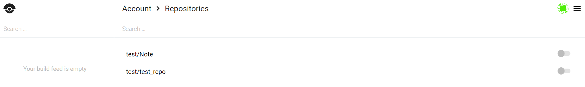
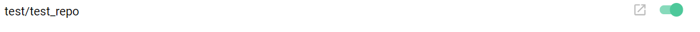

# Drone

# 前言
因為git server選用go語言開發的gitea，而drone也是用go語言開發的，就選用他了。  

# Setup
採用 docker-compose 的方式建立。  
```yml
version: '2'

services:
  drone-server:
    image: drone/drone:0.8

    ports:
      - 8080:8000
      - 9000
    volumes:
      - ./.drone:/var/lib/drone/
    restart: always
    environment:
      - DRONE_OPEN=false
      - DRONE_HOST=https://localhost
      - DRONE_SECRET=123456
      - DRONE_GITEA=true
      - DRONE_GITEA_URL=http://localhost:10080

  drone-agent:
    image: drone/agent:0.8

    command: agent
    restart: always
    depends_on:
      - drone-server
    volumes:
      - /var/run/docker.sock:/var/run/docker.sock
    environment:
      - DRONE_SERVER=drone-server:9000
      - DRONE_SECRET=123456
```  
啟動: `sudo docker-compose up`  
網址: https://localhost:8080  
連上後，會看到:  
  
輸入你的 gitea 上的帳密，就會看到:  
  
就可以開始玩看看摟~

# Start
將你要的 repository 打開  
  
並點選右上角的 settings 設定:  
  

將 .drone.yml 放在專案的根目錄，範例如下 (因為只是要測試能不能動，所以只讓他 echo 一串字):
```yml
pipeline:
  backend:
    image: golang
    commands:
      - echo "backend testing"
```

再來 push 一個 commit 他就會開始瞜  
  
  

完成後 (因為 .drone.yml 中的 image 我還沒pull下來，所以會跑有點久)  
  
  


# Reference
[drone doc](http://docs.drone.io/)  
[drone github](https://github.com/drone/drone)  
[setting up continuous delivery with drone](https://drailing.net/2018/02/setting-up-continuous-delivery-with-drone/)  
[使用 Docker & Drone 建立簡易自動部署流程 — Part1](https://medium.com/@stu60610/使用-docker-drone-建立簡易自動部署流程-part1-a180eb48ff37)  