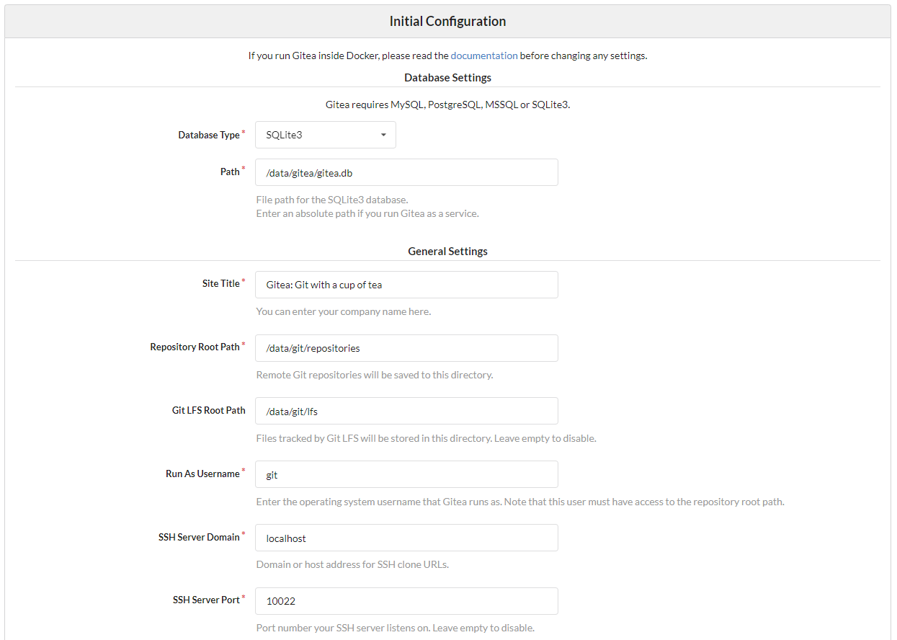
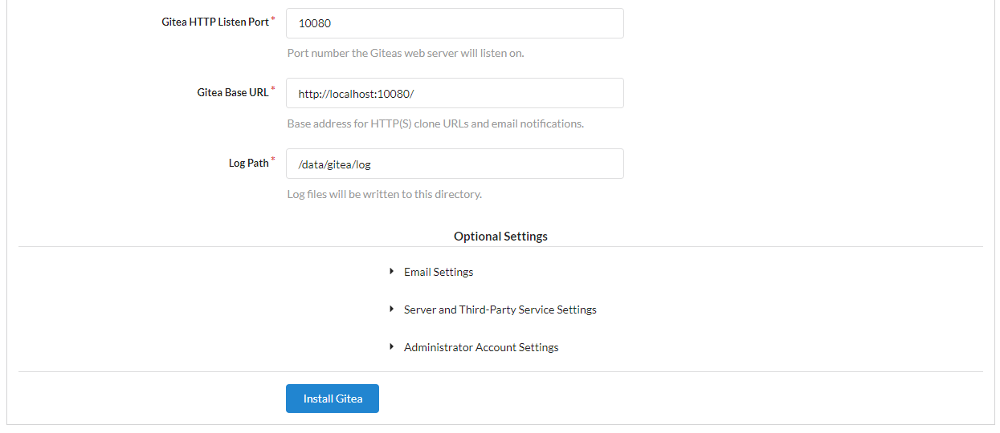

# gitea

# 前言
本來是想玩玩gitlab，但後來看到這個用go語言寫的gitea，想說來玩玩新東西，就選用他了。  

# Setup
`docker pull gitea/gitea:latest`  
`sudo mkdir -p /var/lib/gitea`  
將本機的10022 port連至docker的22 port、10080 port連至3000 port。  
`docker run -d --name=gitea -p 10022:22 -p 10080:3000 -v /var/lib/gitea:/data gitea/gitea:latest`  

# Initialization
架起來後，連到http://localhost:10080/會看到下面畫面。  
  
點選Register會看到初始化界面。  
  
  
請將http和ssh port改成本機的後，按下Install Gitea即完成。  


# Note
當push時，如果發生以下問題時  
```
! [remote rejected] master -> master (pre-receive hook declined)
error: failed to push some refs to 'http://localhost:10080/test/test_repo.git'
```
請至/var/lib/gitea/conf/app.ini將設定改成:
```
HTTP_PORT = 3000
LOCAL_ROOT_URL = http://localhost:3000/
ROOT_URL = http://localhost:10080/
```
並將docker container restart即解決。  

# Reference
[Installation with Docker](https://docs.gitea.io/zh-tw/install-with-docker/)  